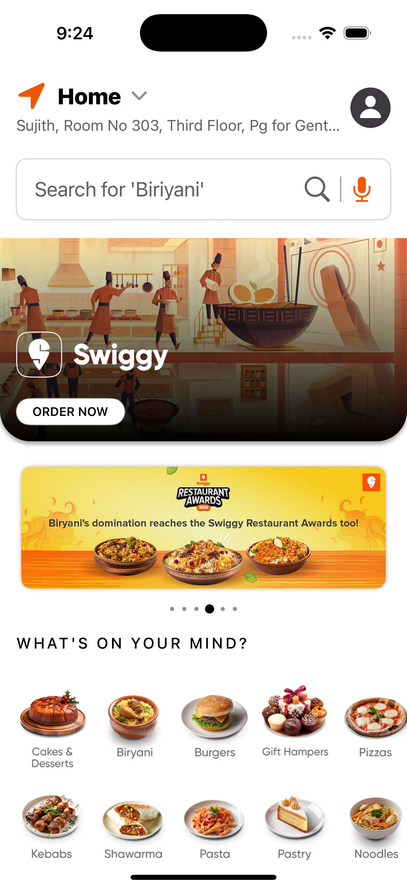
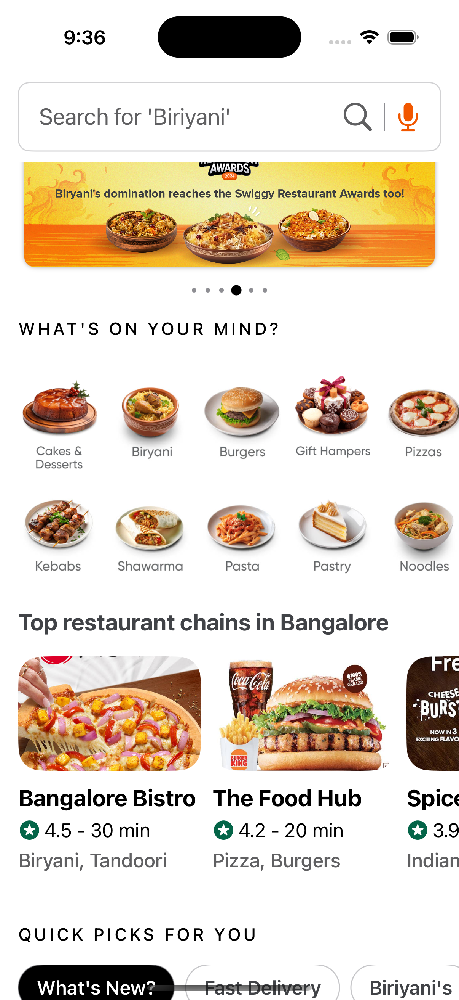
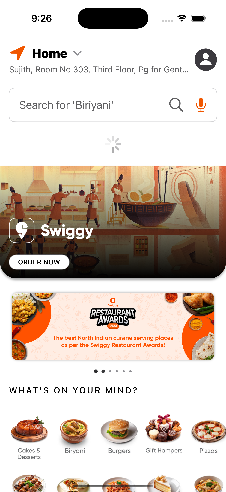
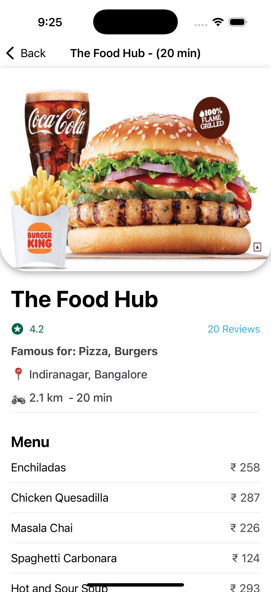
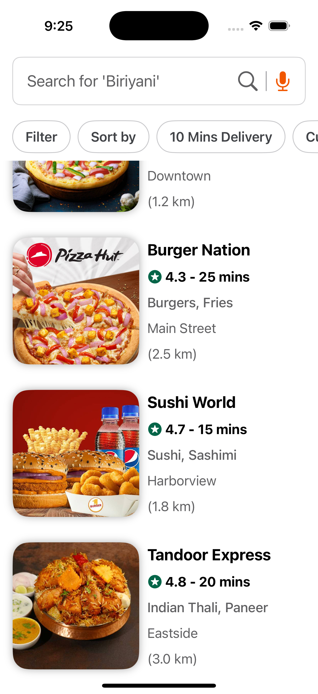
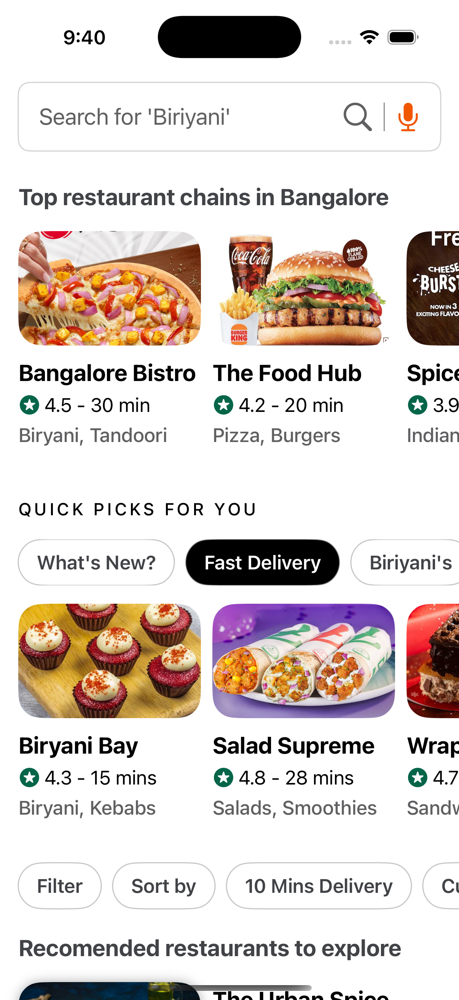

# 📱 Swiggy UI Clone – iOS App

This is a native iOS app that mimics the Swiggy food ordering page with smooth vertical and horizontal scrolling, a sticky header, and interactive navigation. It is built using **UIKit/SwiftUI** and is optimized for performance and user experience.

## 📂 Screenshots

|Home Page| Sticky Search | Pull-to-Refresh|
|---|---|---|
||||

|Restaurant Details| Sticky Header | Tabbed Widgets |
|---|---|---|
||||


## 📖 Features

* **Sticky Header**

  * The header stays fixed at the top while scrolling.
  * Contains Address, Search bar, and Profile icon.

* **Vertical Collection View**

  * Multiple sections arranged vertically.
  * Example sections:

    * Horizontal image banners.
    * Horizontal restaurant lists.

* **Horizontal Scroll Sections**

  * Image collections scroll smoothly left and right.

* **Pull-to-Refresh**

  * Gesture-based refresh below the sticky header.
  * Reloads content dynamically.

* **Cell Navigation**

  * Clicking on an image navigates to a details page.
  * Details page contains text and images similar to \[reference link].

* **Tab Widgets**

  * Easily navigate between sections.

* **Sticky Filters**

  * Filters remain visible while scrolling for quick access.

* **Smooth UX**

  * No crashes.
  * Optimized for large datasets.
  * Seamless vertical and horizontal scrolling.
  * Smooth transitions between pages.


### ✅ Assumptions
* Mock or hardcoded data is used; no real-time API integration.


## 📥 How to Run

1. Clone the repository:

   ```bash
   git clone https://github.com/YourUsername/swiggy-ui-clone-ios.git
   ```

2. Open the project in Xcode.

3. Select the target device or simulator.

4. Build and run the app.


## 📦 Tech Stack

* **Language:** Swift
* **Frameworks:** SwiftUI
